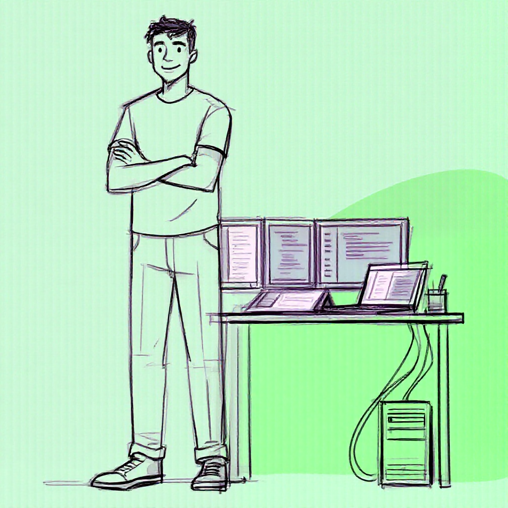
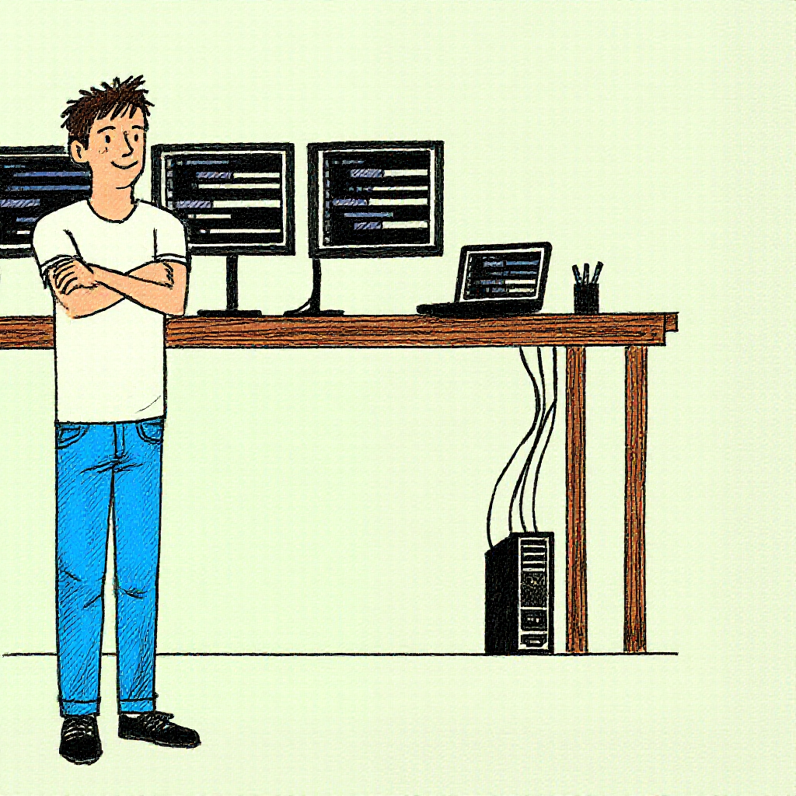
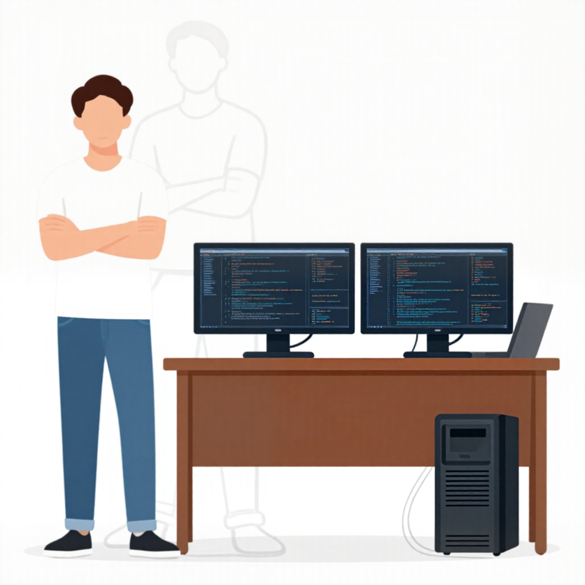

# Bad briefs, and what each one produced

Four runs of `briefs/hero-character/brief.md` that were rejected, in the order
they happened. The brief asked for one young man standing to the left of a desk
with two monitors and a laptop, on plain paper.

Each case quotes the sentence that did the damage. The full prompt, and the
negative prompt where one was applied, is in the `.json` beside each image.

One caution before reading. Each case is a single sample, so "this sentence
caused that fault" is a reading, not a proof. What makes the readings worth
keeping is that each one predicted the next edit, and the edit worked.

| Case | Fault you can point at | Rule it broke |
|---|---|---|
| [1](#1-the-brief-that-argued-with-itself) | green striped ground, near-empty screens, desk touching him | prohibitions in the positive, a word in both blocks, a chroma key |
| [2](#2-right-colours-wrong-frame) | desk runs behind him and off the frame, three monitors, green paper | position carried by prose alone |
| [3](#3-the-prose-and-the-control-disagreed) | a ghost of a second man, and no face | two sources of composition, and a requirement that was never written |
| [4](#4-a-relation-written-as-a-prohibition) | the desk passes behind his legs, with drawers nobody asked for | "never behind him" |

---

## 1. The brief that argued with itself

`IMAGE_BACKEND=local`, Z-Image base, 24 steps, from noise.
[`1-ink-on-chroma.json`](hero-first-pass/1-ink-on-chroma.json)

**What was sent.** From the brief:

```text
His shirt and trousers are drawn as clean contours with the paper showing
through them, not filled in.
...
The monitor bezels and the laptop body are outlines, not filled shapes
...
Leave clear space between the man and the desk.
```

From the style anchor, appended automatically, positive then negative:

```text
muted desaturated indigo #5D5D9C only on the code shown on screens,
flat uniform #00FF00 background
```

```text
... sketchy lines, wobbly lines, double struck lines, colour, coloured
clothing, saturated colours ...
```

**What came back.**



**What is wrong, observably.**

- The background is not one colour. It is pale mint with vertical stripes and a
  saturated green shape in the lower right corner.
- The screens are nearly empty: a few pale marks where the code should be.
- The desk touches him. Its left edge and the first monitor meet his arm.
- The line is a loose sketch with doubled strokes, which the negative block
  listed as forbidden.

**The rule, and what changed.**

Three separate mistakes, and each became a rule.

*A word in both blocks cancels.* The positive asked for indigo code and the
negative listed `colour`. Guidance pushes the result away from the negative, so
the code was asked for and pushed away in the same run. Now a check:
`scripts/check_anchors.py`, and `scripts/check_briefs.py` for the briefs. See
[`never-both-blocks.md`](../solutions/never-both-blocks.md).

*A prohibition in the positive aims at the thing.* "Not filled in" and "not
filled shapes" put the word *filled* in front of the model twice. Prohibitions
were moved out of the brief and into the negative block. See
[`prohibitions-do-not-belong-in-the-positive.md`](../solutions/prohibitions-do-not-belong-in-the-positive.md).

*A diffusion model does not paint a uniform key colour.* The `#00FF00` ground was
there to be keyed out, and a striped ground cannot be keyed. The background
became the page's own paper, and the cutout stopped matching a colour at all.
See [`the-wrong-keyer.md`](../solutions/the-wrong-keyer.md).

And one that did not need a lesson file: "leave clear space" names no amount, so
any amount satisfies it, including none.

---

## 2. Right colours, wrong frame

`IMAGE_BACKEND=local`, Z-Image base, 28 steps, from noise.
[`2-right-colours-wrong-frame.json`](hero-first-pass/2-right-colours-wrong-frame.json)

**What was sent.** By now the brief named every material and gave the gap a
size:

```text
A wide gap of empty paper separates him from the furniture. He is not leaning on
the desk and not touching it; there is roughly a third of his own body width of
clear space between his shoulder and the nearest edge of it.

To the right of that gap stands a brown wooden desk on straight legs ...
two identical widescreen monitors side by side
```

**What came back.**



**What is wrong, observably.**

- The desk runs behind him and out through the left edge of the frame. There is
  no gap of any width.
- There are three monitors, and the frame cuts the third in half behind his head.
- The paper is pale green rather than the off-white that was asked for.
- His feet stand below the ground line the desk rests on.

What is right matters as much: white shirt, blue jeans the full length of the
leg, brown desk, black bezels, black tower, coloured code on dark screens. Every
material the brief named arrived. This is the frame that showed the brief could
carry *what things are*, and could not carry *where things go*.

**The rule, and what changed.**

Composition stopped being asked for in prose. The next runs passed a line drawing
of the layout with `--control`, on the `local-cn` backend, and the brief gained
a second, much shorter section for that case, `## Prompt with structure`, which
says only what things are made of. See section 2 of [`../guide.md`](../guide.md).

The sentence "he is not leaning on the desk and not touching it" is the same
mistake as in case 1 and survived into this run, and into the approved one. It
has since been taken out of the brief; the [good brief page](good-brief.md)
shows the before and after.

The green paper is not a brief problem at all. It is the backend's colour cast,
and it is removed afterwards with `scripts/postprocess.py --white-balance`. See
[`a-colour-cast-is-not-uniform.md`](../solutions/a-colour-cast-is-not-uniform.md).

---

## 3. The prose and the control disagreed

`IMAGE_BACKEND=local-cn`, ControlNet at strength 0.85, 14 steps.
[`3-ghost-of-the-control.json`](hero-first-pass/3-ghost-of-the-control.json)

**What was sent.** A line drawing as the control image, and this:

```text
A young man with light skin and short dark brown hair, wearing a plain white
t-shirt, mid-blue denim jeans and black sneakers, standing at the far left of
the scene with his arms crossed
```

Nothing in the prompt mentions his face.

**What came back.**



**What is wrong, observably.**

- A second figure stands behind him in pale outline, arms crossed, further to
  the right.
- He has no face. The head is a flat skin-coloured oval.
- The style is flat with no drawn line, where the spec at the time asked for
  hand-drawn ink. The CLI had printed a warning that this backend discards the
  negative prompt.

**The rule, and what changed.**

*Two sources of composition, and the model drew both.* The control image placed
the figure in one spot and the words "at the far left of the scene" placed him
in another. He was painted where the prose said, and the control's figure was
left behind as a ghost. With a control image, the prose stops describing
position.

*A requirement that is not in the prompt did not reach the model.* The brief's
header said "facing the viewer with a small smile", and the acceptance list
assumed a face. Neither is sent. Only the text under the prompt heading is. The
next run added "his face is fully drawn and turned toward the viewer: two clear
eyes, eyebrows, a nose, and a small closed smile", and the face came back. See
[`the-model-has-no-memory.md`](../solutions/the-model-has-no-memory.md).

*The style change was the backend, not the brief.* The ControlNet model is
guidance-distilled, so the entire negative block was thrown away, and the
negative block had been carrying the hand-drawn look. This frame is why a
backend has to declare what it ignores. The flat result was liked, and the
anchor was rewritten around it rather than the other way round. See
[`the-negative-block-was-carrying-the-style.md`](../solutions/the-negative-block-was-carrying-the-style.md).

---

## 4. A relation written as a prohibition

`IMAGE_BACKEND=local-cn`, ControlNet at strength 0.85, 14 steps.
[`4-desk-behind-him.json`](hero-first-pass/4-desk-behind-him.json)

**What was sent.**

```text
standing to the left of the desk with his arms crossed. The desk is entirely to
his right, never behind him, and his whole body is visible and clear of it.
```

**What came back.**


**What is wrong, observably.**

- The desk passes behind his legs. Its left end is to the left of his left hip.
- The desk has a column of drawers. No drawer is mentioned anywhere.
- The first monitor is partly hidden by his elbow.

The face is there now, which was the previous case's fix landing.

**The rule, and what changed.**

"Never behind him" contains *behind him*, and there is no negative block on this
backend to push against it. The fix was to stop describing where the desk must
not be and describe the empty space as a thing that exists:

```text
The desk is narrow and occupies only the right half of the scene. Between him
and the desk there is a vertical strip of empty background
```

That paragraph is the only difference between this prompt and the next one, and
the next one was approved: [`good-brief.md`](good-brief.md).

---

## The pattern across all four

| What the brief did | What to do instead |
|---|---|
| said what must not be there | describe what is there instead; put real prohibitions in the negative block of the spec |
| named a relation without a size | give the size, in units the picture contains: "a third of his body width", "the right half of the scene" |
| left a requirement in the header or the acceptance list | put it under the prompt heading, or it is not sent |
| described position in prose and in a control image | pick one. With `--control`, the prose describes materials only |
| blamed the brief for the backend | read the warning the CLI prints, and check what the backend discards |

The table of symptoms in section 9 of [`../guide.md`](../guide.md) is the same
idea from the other end: start from what you see, find what usually causes it.
