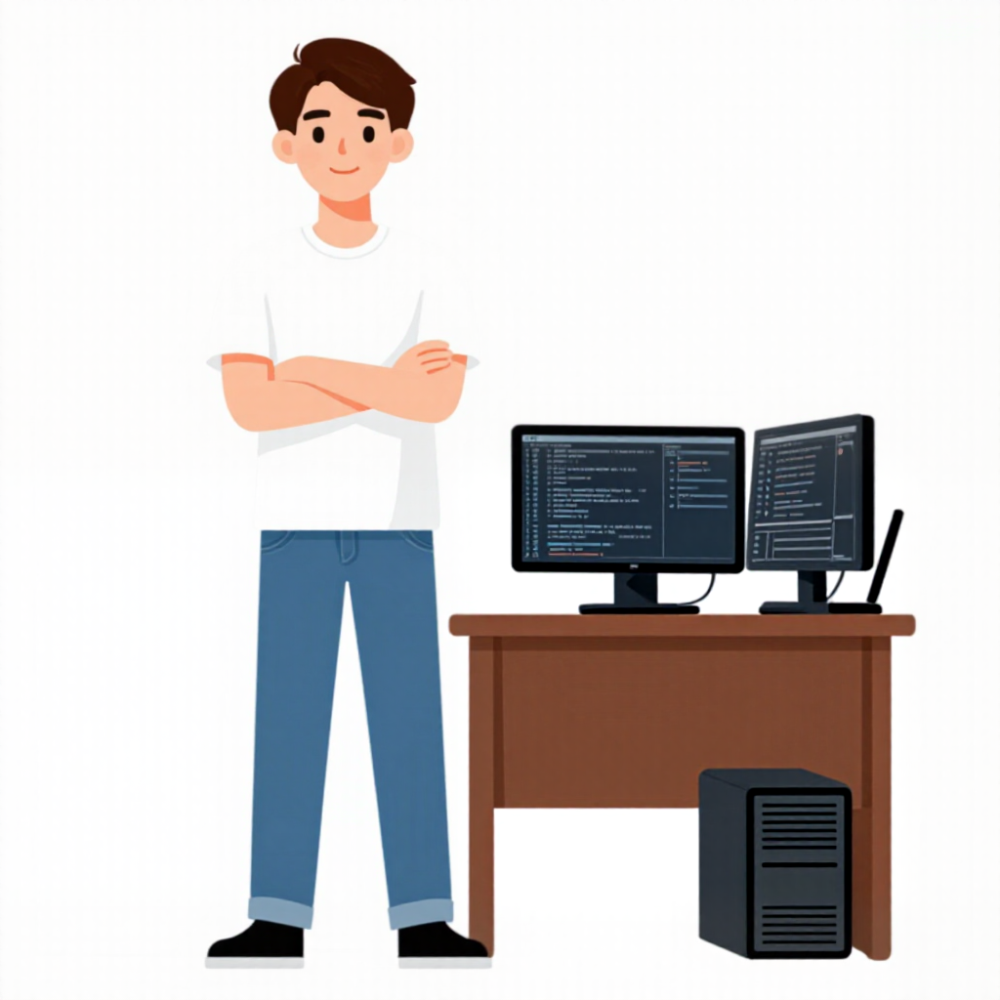

# A good brief, and a result that can be good

The run that was approved as `hero-character-v1`, after the four on
[`bad-briefs.md`](bad-briefs.md).

"Can be good" is deliberate. A diffusion model samples, so the same brief gives
a different image on the next run, and no brief makes that go away. What a brief
controls is which images are likely. This is one sample from a good one: it was
accepted with defects, they are listed below, and the wording it was sent with
broke one of this repository's own rules. All of that is on this page, because
an example that only shows the flattering half teaches the wrong thing.

| | |
|---|---|
| brief | [`briefs/hero-character/brief.md`](../../briefs/hero-character/brief.md), section `## Prompt with structure` |
| image | [`hero-character-v1.png`](../../briefs/hero-character/approved/hero-character-v1.png) |
| exact prompt | [`hero-character-v1.json`](../../briefs/hero-character/approved/hero-character-v1.json) |
| recipe | [`approved/README.md`](../../briefs/hero-character/approved/README.md) |
| backend | `local-cn`, ControlNet `canny` at 0.85, 14 steps, 1024x1024 |

## What was sent

```text
A young man with light skin and short dark brown hair, wearing a plain white
t-shirt, mid-blue denim jeans and black sneakers, standing to the left of the
desk with his arms crossed. The desk is entirely to his right, never behind him,
and his whole body is visible and clear of it. His face is fully
drawn and turned toward the viewer: two clear eyes, eyebrows, a nose, and a
small closed smile. Every surface of him is evenly lit, one flat tone per area,
with no darker side and no shading under the chin or the arms.

The desk is narrow and occupies only the right half of the scene. Between him
and the desk there is a vertical strip of empty background, and no part of the
desk passes behind him.

Beside him stands a brown wooden desk holding two identical widescreen monitors
of exactly the same size, side by side, and an open laptop at the far right
corner of the desk with its screen turned to face the viewer straight on, not
angled away. The computer tower stands on the floor beside the desk rather than
on top of it. The screens are dark and carry lines of code in muted syntax
colours.
```

Followed by the style anchor from `docs/ILLUSTRATION_SPEC.md`, appended by
`src/generate.py`. The brief contains no line weight, no palette and no texture.

## What came back



## Why this one worked

Each point is the fix for a case on the other page.

- **Every material is named.** White t-shirt, mid-blue denim, black sneakers,
  brown wooden desk. Nothing is left for the model to choose, so nothing was
  chosen badly. Case 2 had already shown this half of the brief worked.
- **The face is asked for, part by part.** "Two clear eyes, eyebrows, a nose,
  and a small closed smile." Case 3 came back with no face because no sentence
  asked for one.
- **The empty space is described as a thing that exists.** "A vertical strip of
  empty background", and a desk that "occupies only the right half of the
  scene". Case 4 said where the desk must not be and got it there.
- **The prose does not place the figure.** A control drawing does. The prompt is
  three short paragraphs because the layout arrives as pixels, and a short prompt
  dilutes each clause less.
- **Style is absent from the brief.** It lives once in the spec, so the next
  asset gets the same one without anyone copying it.

## Checked against its own acceptance criteria

The brief's `## Acceptance` list as it stood on the day, applied to this image. This is what "observable
criteria" buys: each line gets an answer rather than an impression.

| Criterion | Result |
|---|---|
| Every filled area is flat | holds |
| There is clear empty paper between the man and the desk | holds, narrowly. The gap is about the width of his forearm, not "wide enough to see at a glance" |
| Nothing casts a shadow on the floor, no edge is soft | holds |
| The background is plain paper and nothing else | holds |
| Nothing in the drawing touches the frame | holds |
| No readable words. The code is marks, not text | holds |
| Recognisable as a developer next to a workstation in three seconds | holds |
| The colours are the ones in the spec's Tokens table | **not measured.** It was judged by eye, which is the thing the criterion exists to avoid |
| The line reads as hand-drawn, with a visible construction stroke | **fails.** There is no drawn line at all. See below |

And against the `Required` line in the brief's header: the two monitors are not
the same size, the laptop is a thin slab that does not read as a laptop, there
are no cables, and there is no pen cup.

## What was still wrong with the brief, and how it reads now

**The prompt that was sent breaks the prohibition rule four times.** The rule in
[`prohibitions-do-not-belong-in-the-positive.md`](../solutions/prohibitions-do-not-belong-in-the-positive.md)
says a "no" in the positive prompt aims at the thing it names. The run was
approved anyway, and the honest reading is that the positive description beside
each prohibition did the work and the prohibition was carried along. The brief
has since been rewritten. Each row is the same request, said as something that
is there:

| Sent with v1 | In `brief.md` now |
|---|---|
| The desk is entirely to his right, **never behind him** | The desk is entirely to his right ... with empty paper behind him from head to foot |
| one flat tone per area, **with no darker side and no shading** under the chin or the arms | one flat tone per area, the same tone on both sides of his face, under his chin and along his arms |
| and **no part of the desk passes behind him** | A wide band of empty background separates him from it, wider than his own shoulders |
| facing the viewer straight on, **not angled away** | facing the viewer straight on |

The right-hand column has not been run. It is the better brief by the rules, and
whether it is the better brief by its images is a question only a run answers.

**The hand-drawn criterion was stale, not failed.** This backend is
guidance-distilled and discards the negative block, which is where the
hand-drawn look was being held. The flat result was preferred and the anchor was
rewritten to describe it, but the acceptance list went on asking for an ink
line. A criterion nobody updated is a criterion that fails every good image. It
now asks for clean flat shapes, and two criteria were added for what this image
got wrong: monitors of one size, and a laptop that reads as a laptop.

**Defects accepted at approval.** An orange artefact between the chin and the
collar, white shapes where the sleeves meet the forearms, and legs slightly long
for the torso. They were judged smaller than the risk of re-rolling the whole
image to chase them.

## Habits that survive the sampling

A run cannot be made to come out the same by wishing, but it can be made
traceable, and these cost nothing:

- **Keep the sidecar with the image.** `brief.md` moves on; the sidecar is the
  only record of what this image was asked for. The middle paragraph quoted
  above exists nowhere else.
- **Fix the seed while changing the prompt.** `MFLUX_SEED=42` on both runs means
  the difference between two images is the sentence you changed, and not luck.
  The sidecar now records the seed and the step count under `settings`; this
  one predates that, and its seed is known only because the recipe wrote it down.
- **Keep the control or init image beside the brief.** The sidecar stores its
  path. This image's control drawing was made in a temporary directory and is
  gone, so the prompt survives and the layout that went with it does not.
- **Write the recipe down at approval**, in `approved/README.md`, with the
  defects you accepted. A month later that list is the difference between a
  known compromise and a bug report.
- **Approve by the acceptance list, not by relief.** The table above took five
  minutes and found a criterion that had never been measured.

## What happened next, and why it matters more than the brief

This image is not the character the hero ships with.

The second approved version, `hero-character-v2`, came from a hosted
instruction-following model rather than from this pipeline. It has no prompt and
no sidecar, and `approved/README.md` says so plainly. A still like this is a
prompt-adherence problem, and local diffusion is weakest exactly there: counts,
framing, long instructions.

What this repository did with that drawing is the part worth copying. Nothing
after it was generated:

| Step | Command | Result |
|---|---|---|
| cut the background off | `scripts/cutout_flat.py` | `hero-character-v2-cutout.png` |
| cut the figure into layers | `scripts/split_layers.py` | `approved/scene/body.png`, `head.png`, `eyes.png` |
| describe how they compose | assembled from the `layers.json` that script writes | `approved/scene/scene.json` |
| watch it move | serve the root, open `preview/index.html` | the head follows the pointer |

Thirteen further runs of a brief copied clause for clause from the approved
character produced a competent young man who was not him. That is the limit of
what a brief can do, however good: it specifies what is in the picture, and
identity lives below that. So once one drawing is approved, the next asset is
cut from it, and generation is the last resort rather than the first. Section 6
of [`../guide.md`](../guide.md) is that rule, and
[`the-second-drawing-is-a-different-person.md`](../solutions/the-second-drawing-is-a-different-person.md)
is what it cost.

## A checklist to take away

Before running a brief of your own:

- [ ] `make briefs` passes, so no word in the prompt is also in the negative block
- [ ] `--dry-run` printed the prompt, and you read all of it
- [ ] every requirement is under the prompt heading, not only in the header
- [ ] nothing under the prompt heading says no, not, never or without
- [ ] every position has a size attached
- [ ] no sentence describes style
- [ ] every acceptance criterion can be answered by pointing
- [ ] the CLI printed no warning about a discarded negative prompt, or you read it and decided
- [ ] any control or init image is saved beside the brief
